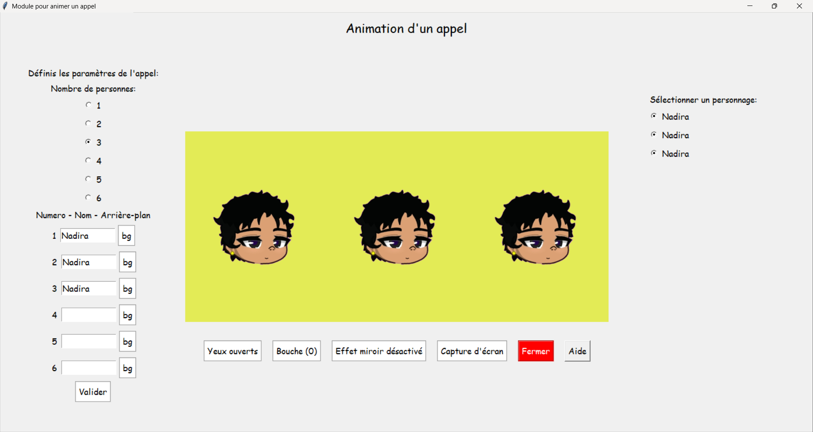

# Logiciel de d'animation d'appel "vidéo" - ANIMATION

Un logiciel pour personnaliser les oc Gacha Life, Gacha Club, Gacha Life 2 dans une interface graphique.

## 📌 Fonctionnalités
- Personnalisation des oc (2 types de yeux, 3 types de bouche, effet miroir).
- Choix de la couleur de fond pour chaque oc.
- Sauvegarde et chargement des configurations.
- Capture d'écran de la scène.

## 📷 Aperçu


## 📁 Organisation des fichiers
Pour que le logiciel fonctionne correctement, vous devez organiser vos images d'avatars comme suit :

1. Créez un dossier `assets/` à la racine du logiciel.
2. Dans `assets/`, créez un dossier pour chaque oc, nommé `Avatar_<prenom>` (ex: `Avatar_Alice`).
3. Dans chaque dossier `Avatar_<prenom>`, placez les fichiers suivants :
   - `Ouverts.png` : Image des yeux ouverts.
   - `Fermés.png` : Image des yeux fermés.
   - `1.png` : Bouche type 1.
   - `2.png` : Bouche type 2.
   - `3.png` : Bouche type 3.

Il faut que chaque image soit dans un format 533*460.
Utilisez une application pour supprimer l'arrière plan de chaque image et pour les images des bouches, ne gardez que la bouche.

## 🚀 Installation
4. Cloner le dépôt :
   ```bash
   git clone https://github.com/Gachadev-Aria/Animation-appel-pour-les-oc-Gacha.git
   cd Animation-appel-pour-les-oc-Gacha

##  Role de l'IA
Ici, l'IA m'a permis de transformer ce projet pour le public et pas que pour mes propres images.
